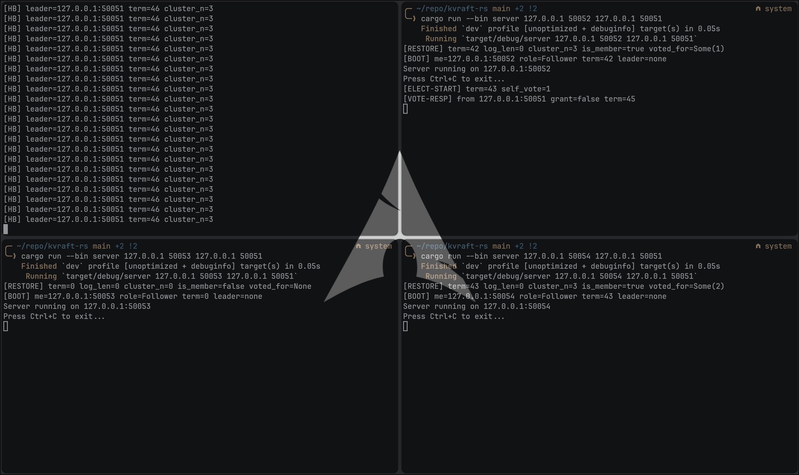
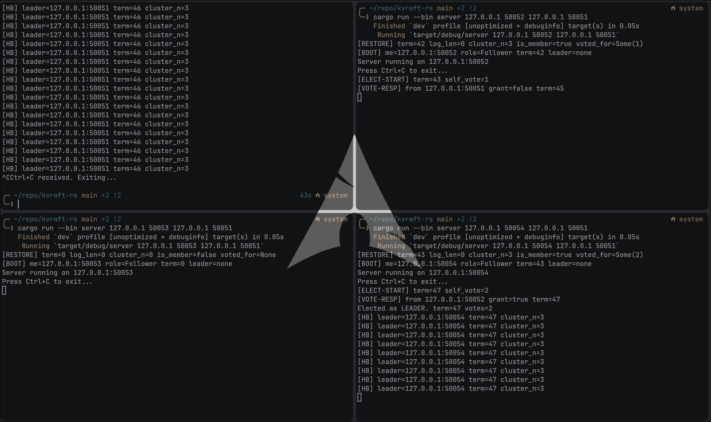
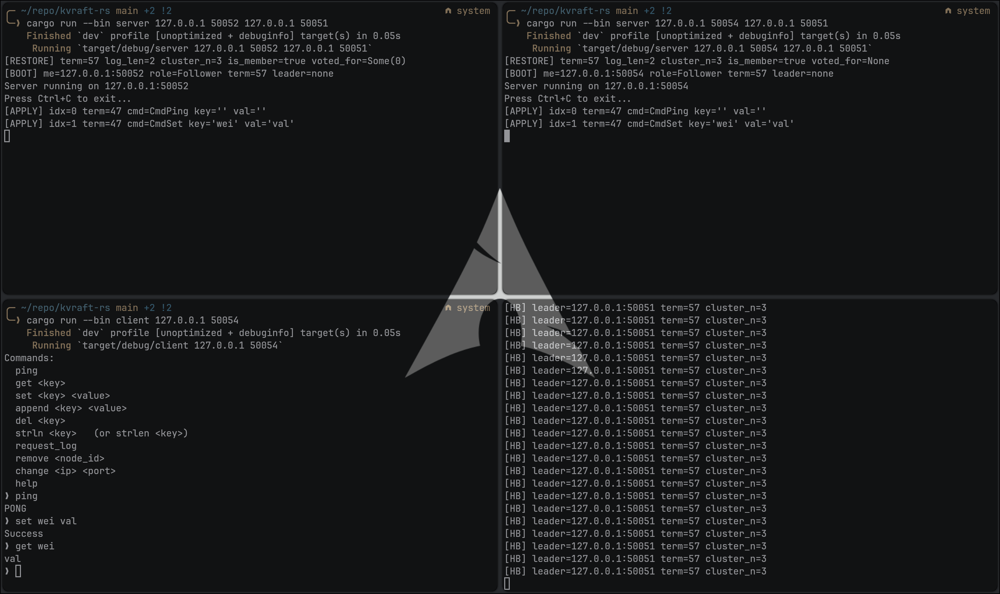
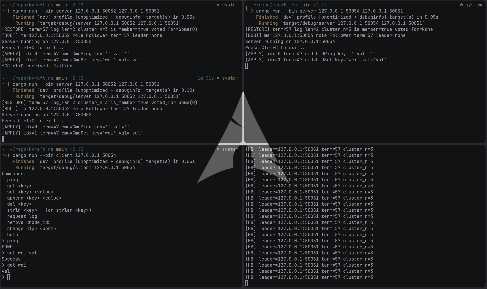

<div align="center">
   
</div>

<div align="center">

   <br/>

   
   
   
   
   

   <br/><br/>

</div>

---

## About

A distributed key-value store built on the **Raft consensus algorithm**, implemented in Rust using Tonic (gRPC) for inter-node communication. The system provides fault-tolerant log replication, automatic leader election, and dynamic cluster membership, allowing any number of server nodes to maintain a consistent KV store across network partitions and node failures. State is persisted to disk so nodes can safely crash and rejoin without losing committed data.

---

## Features

- **Leader Election**
  Nodes autonomously detect leader failure via randomised election timeouts and run a term-based voting round. The candidate with the most up-to-date log and a majority of votes wins and immediately begins sending heartbeats.

- **Heartbeat Mechanism**
  The elected leader periodically broadcasts AppendEntries RPCs to all followers. If a follower does not hear from the leader within its election timeout window, it promotes itself to candidate and starts a new election.

- **Log Replication**
  Every write command (SET, APPEND, DEL) is appended to the leader's log and replicated to a majority of peers before being committed and applied to the in-memory KV store. Followers that fall behind are automatically caught up entry by entry.

- **KV Store Operations**
  Clients interact with the cluster through a CLI that supports `ping`, `get`, `set`, `append`, `del`, `strln`, and `request_log`. All mutating commands are linearised through the Raft log; reads are served directly by the leader.

- **Membership Change**
  New nodes join by contacting any existing cluster member and receiving the current cluster configuration and log. Nodes can also be removed at runtime via the `remove <node_id>` command, which is committed through the log so all peers apply the change atomically.

- **Automatic Leader Redirect**
  If a client contacts a non-leader node, the node returns the known leader address and the client transparently retries against the correct node, up to five hops.

- **State Persistence**
  `current_term`, `voted_for`, `log[]`, and `cluster` are atomically flushed to `state-<port>.json` before every RPC reply. On restart a node loads its snapshot, starts as Follower, and catches up via the leader's AppendEntries, satisfying the durability requirement in Figure 2 of the Raft paper.

---

## Tech Stack

| Layer | Technology |
|:---|:---|
| Language | Rust (2021 edition) |
| Async Runtime | Tokio (multi-thread) |
| RPC Framework | Tonic (gRPC over HTTP/2) |
| Protocol Definition | Protocol Buffers v3 |
| Serialization | Prost (protobuf) + serde / serde_json |
| Persistence | JSON snapshots via serde_json |
| CLI | Native stdin REPL with quote-aware tokenizer |

---

## Screenshots

<div align="center">

| 4-Node Cluster Init | Leader Killed | Client Commands | Crash + Log Persist |
|:---:|:---:|:---:|:---:|
| <br/><sub>All 4 nodes started, leader elected on boot</sub> | <br/><sub>Leader killed, follower wins re-election</sub> | <br/><sub>set / get / append / del via CLI</sub> | <br/><sub>Node crashes, restarts, log persisted to disk</sub> |

</div>

---

## How to Run

> **Prerequisites:** Rust toolchain (`cargo`) installed.

> [!WARNING]
> Each node persists its state (`current_term`, `voted_for`, `log`, cluster membership) to `state-<port>.json`.
> If you want to start a **fresh cluster** on ports you have used before, delete the old state files first:
> ```bash
> rm -f state-*.json
> ```
> Running a new cluster without clearing old state files causes nodes to load a stale cluster config,
> which results in split-vote loops and followers that never learn the current leader.

### Build

```bash
cargo build
```

### Start the first node (bootstrap leader)

```bash
cargo run --bin server <ip> <port>
# example
cargo run --bin server 127.0.0.1 50051
```

### Add more nodes to the cluster

```bash
cargo run --bin server <ip> <port> <leader_ip> <leader_port>
# example
cargo run --bin server 127.0.0.1 50052 127.0.0.1 50051
cargo run --bin server 127.0.0.1 50053 127.0.0.1 50051
```

### Connect a client

```bash
cargo run --bin client <ip> <port>
# example
cargo run --bin client 127.0.0.1 50051
```

### Available client commands

| Command | Description |
|:---|:---|
| `ping` | Test connectivity (goes through Raft log) |
| `get <key>` | Read a value |
| `set <key> <value>` | Write a value |
| `append <key> <value>` | Append to an existing value |
| `del <key>` | Delete a key |
| `strln <key>` | Get string length of a value |
| `request_log` | View the full replication log |
| `remove <node_id>` | Remove a node from the cluster |
| `change <ip> <port>` | Switch the client to a different server |
| `help` | Print command list |

---

## Project Structure

```
kvraft-rs/
├── build.rs                  # Compiles proto -> Rust via tonic-prost-build
├── Cargo.toml
├── proto/
│   └── raft_service.proto    # gRPC service + message definitions
└── src/
    ├── server.rs             # Raft node: state machine, RPC handlers, background tasks
    └── client.rs             # CLI client with redirect-aware RPC helpers
```

---

## Authors

<div align="center">

| NIM | Name |
|:---:|:---|
| 13523126 | Brian Ricardo Tamin |
| 13523127 | Boye Mangaratua Ginting |
| 13523142 | Nathanael Rachmat |

</div>

---

<div align="center">
   
</div>
