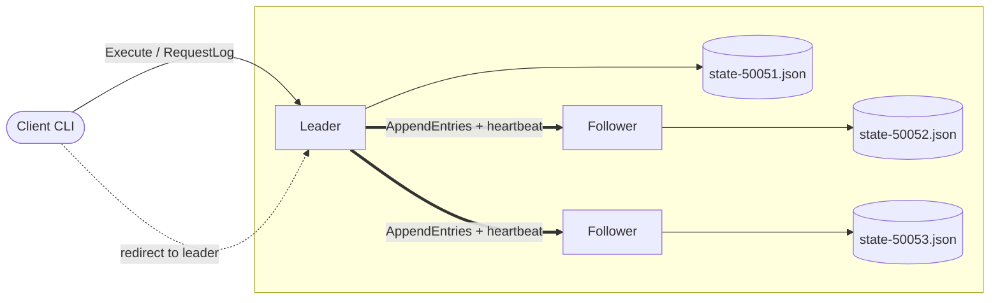

<div align="center">
   
</div>

<div align="center">

   <br/>

   
   
   
   
   

   <br/><br/>

</div>

---

## About

A distributed key-value store built on the **Raft consensus algorithm**, implemented in Rust using Tonic (gRPC) for inter-node communication. The system provides fault-tolerant log replication, automatic leader election, and dynamic cluster membership, allowing any number of server nodes to maintain a consistent KV store across network partitions and node failures. State is persisted to disk so nodes can safely crash and rejoin without losing committed data.

---

## Architecture



**Normal operation:** the client sends commands to the leader (if it hits a follower it is redirected, up to 5 hops). The leader appends each write to its log and replicates it to followers via `AppendEntries`. Once a majority store an entry it is committed and applied to the in-memory KV store. Every node flushes its term, vote, log, and cluster config to `state-<port>.json` before replying.

**On leader failure:** a follower whose election timeout expires becomes a candidate, bumps its term, and broadcasts `VoteMe` to every other node. The one that collects a majority of votes becomes the new leader and starts sending heartbeats. A crashed node restarts as a follower and catches up from the current leader.

### Inside an AppendEntries message

`AppendEntries` is the leader's single workhorse RPC, it carries new log entries and also doubles as the heartbeat when there is nothing new to send.

| Field | What it carries | Why it matters |
|:---|:---|:---|
| `term` | Leader's current term | Followers reject anything from an older term, and step down if theirs is behind |
| `leader_id` | Slot of the sending leader | Lets a follower learn and redirect clients to the current leader |
| `prev_log_index` / `prev_log_term` | Position and term right before the new entries | The follower only accepts if this point matches, keeping logs consistent |
| `entries` | The actual log entries to append | Empty on a plain heartbeat, filled when replicating writes |
| `leader_commit` | Leader's commit index | Tells followers how far they can safely apply entries to the KV store |
| `cluster_config` | Current list of cluster members | Keeps every node's view of membership in sync |

The reply (`AppendReply`) is just the follower's `term` and a `success` flag. On failure the leader steps `prev_log_index` back and retries from an earlier point until the logs line up.

---

## Features

- **Leader Election**
  Nodes autonomously detect leader failure via randomised election timeouts and run a term-based voting round. The candidate with the most up-to-date log and a majority of votes wins and immediately begins sending heartbeats.

- **Heartbeat Mechanism**
  The elected leader periodically broadcasts AppendEntries RPCs to all followers. If a follower does not hear from the leader within its election timeout window, it promotes itself to candidate and starts a new election.

- **Log Replication**
  Every write command (SET, APPEND, DEL) is appended to the leader's log and replicated to a majority of peers before being committed and applied to the in-memory KV store. Followers that fall behind are automatically caught up entry by entry.

- **KV Store Operations**
  Clients interact with the cluster through a CLI that supports `ping`, `get`, `set`, `append`, `del`, `strln`, and `request_log`. All mutating commands are linearised through the Raft log; reads are served directly by the leader.

- **Membership Change**
  New nodes join by contacting any existing cluster member and receiving the current cluster configuration, then catch up their log through the leader's AppendEntries. Nodes can also be removed at runtime via the `remove <node_id>` command, which is committed through the log so all peers apply the change atomically.

- **Automatic Leader Redirect**
  If a client contacts a non-leader node, the node returns the known leader address and the client transparently retries against the correct node, up to five hops.

- **State Persistence**
  `current_term`, `voted_for`, `log[]`, and `cluster` are atomically flushed to `state-<port>.json` before every RPC reply. On restart a node loads its snapshot, starts as Follower, and catches up via the leader's AppendEntries, so committed data survives crashes and restarts.

---

## Tech Stack

| Layer | Technology |
|:---|:---|
| Language | Rust (2021 edition) |
| Async Runtime | Tokio (multi-thread) |
| RPC Framework | Tonic (gRPC over HTTP/2) |
| Protocol Definition | Protocol Buffers v3 |
| Serialization | Prost (protobuf) + serde / serde_json |
| Persistence | JSON snapshots via serde_json |
| CLI | Native stdin REPL with quote-aware tokenizer |

---

## Screenshots

<div align="center">

| 4-Node Cluster Init | Leader Killed | Client Commands | Crash + Log Persist |
|:---:|:---:|:---:|:---:|
| <br/><sub>All 4 nodes started, leader elected on boot</sub> | <br/><sub>Leader killed, follower wins re-election</sub> | <br/><sub>set / get / append / del via CLI</sub> | <br/><sub>Node crashes, restarts, log persisted to disk</sub> |

</div>

---

## How to Run

> **Prerequisites:** Rust toolchain (`cargo`) installed.

> [!WARNING]
> Each node persists its state (`current_term`, `voted_for`, `log`, cluster membership) to `state-<port>.json`.
> If you want to start a **fresh cluster** on ports you have used before, delete the old state files first:
> ```bash
> rm -f state-*.json
> ```
> Running a new cluster without clearing old state files causes nodes to load a stale cluster config,
> which results in split-vote loops and followers that never learn the current leader.

### Build

```bash
cargo build
```

### Start the first node (bootstrap leader)

```bash
cargo run --bin server <ip> <port>
# example
cargo run --bin server 127.0.0.1 50051
```

### Add more nodes to the cluster

```bash
cargo run --bin server <ip> <port> <leader_ip> <leader_port>
# example
cargo run --bin server 127.0.0.1 50052 127.0.0.1 50051
cargo run --bin server 127.0.0.1 50053 127.0.0.1 50051
```

### Connect a client

```bash
cargo run --bin client <ip> <port>
# example
cargo run --bin client 127.0.0.1 50051
```

### Available client commands

| Command | Description |
|:---|:---|
| `ping` | Test connectivity (goes through Raft log) |
| `get <key>` | Read a value |
| `set <key> <value>` | Write a value |
| `append <key> <value>` | Append to an existing value |
| `del <key>` | Delete a key |
| `strln <key>` | Get string length of a value |
| `request_log` | View the full replication log |
| `remove <node_id>` | Remove a node from the cluster |
| `change <ip> <port>` | Switch the client to a different server |
| `help` | Print command list |

---

## Project Structure

```
kvraft-rs/
├── build.rs                  # Compiles proto -> Rust via tonic-prost-build
├── Cargo.toml
├── proto/
│   └── raft_service.proto    # gRPC service + message definitions
└── src/
    ├── server.rs             # Raft node: state machine, RPC handlers, background tasks
    └── client.rs             # CLI client with redirect-aware RPC helpers
```

---

<div align="center">
   
</div>
